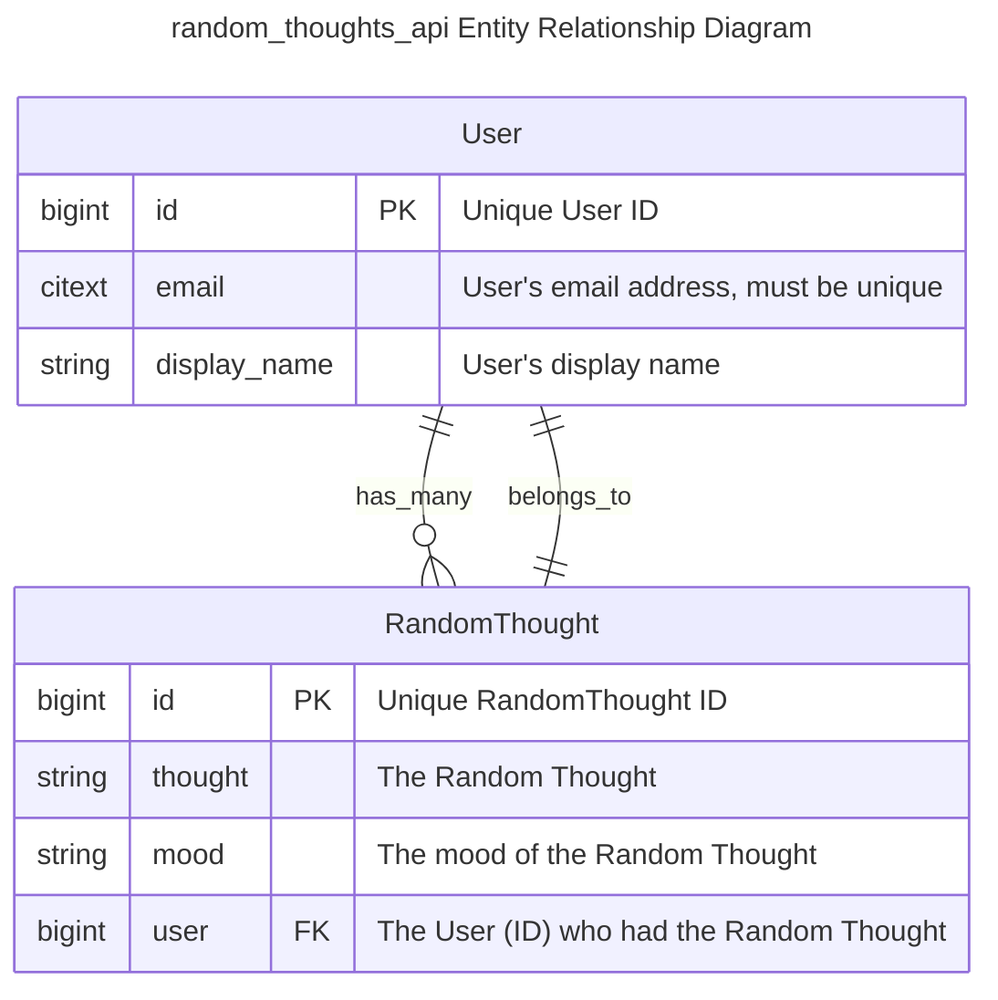

## random_thoughts_api Data Model
The `random_thoughts_api` application has a simple Data Model with
two entities:

1. ***Users*** which have two primary attributes:
   1. An *email* address which must be unique
   2. A *display_name*

2. ***RandomThoughts*** which also have two primary attributes
   1. The *thought*
   2. The *mood* of the thought or of the ***User*** when they had
      the thought

There are two relationships between ***Users*** and
***RandomThoughts***:
1. A ***User*** has zero to many ***RandomThoughts***
   (i.e. `has_many`)
2. A ***RandomThought*** has exactly one ***User***
   (i.e. `belongs_to`)

This data model (as an
[Entity Relationship Diagram](https://en.wikipedia.org/wiki/Entity%E2%80%93relationship_model))
is shown below.

---

